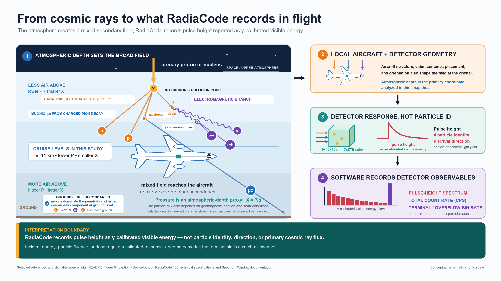
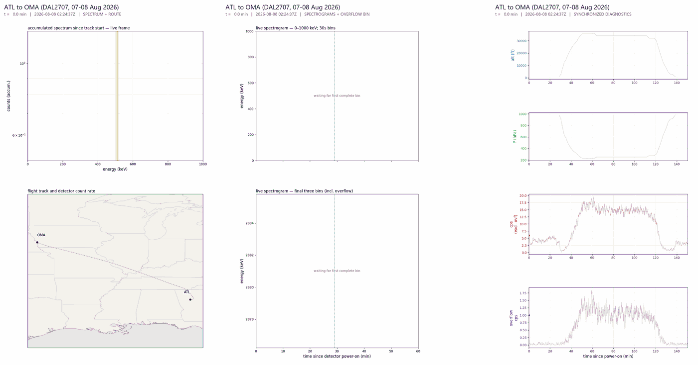
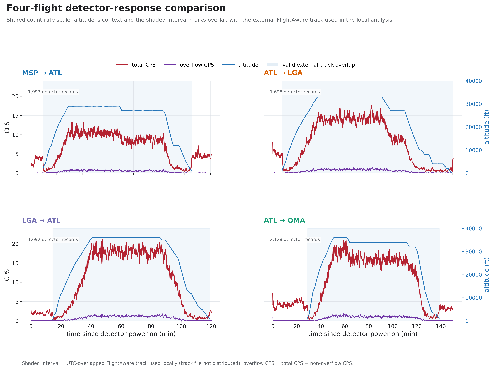
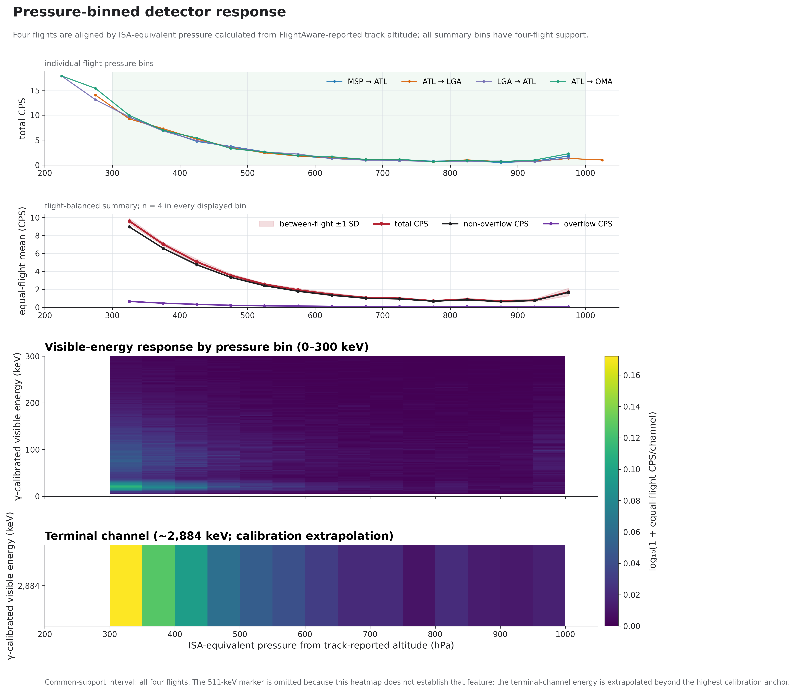
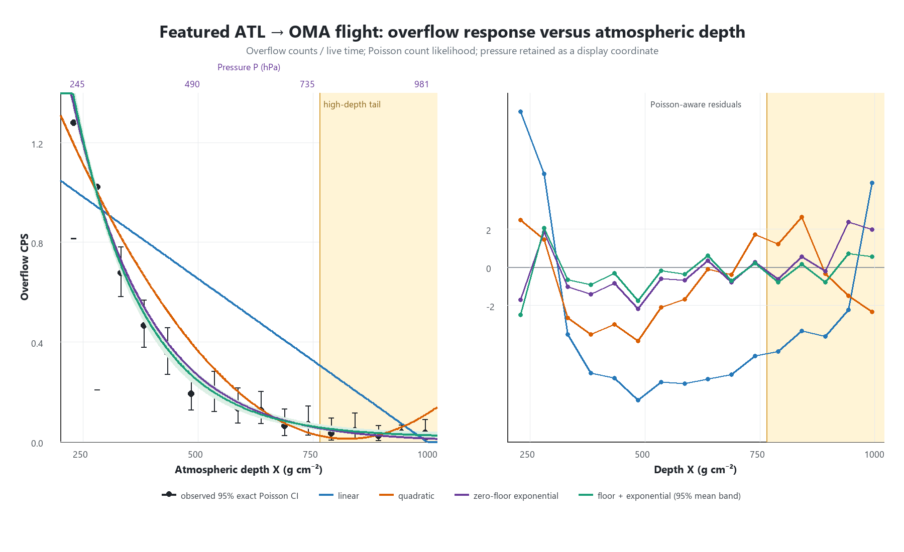
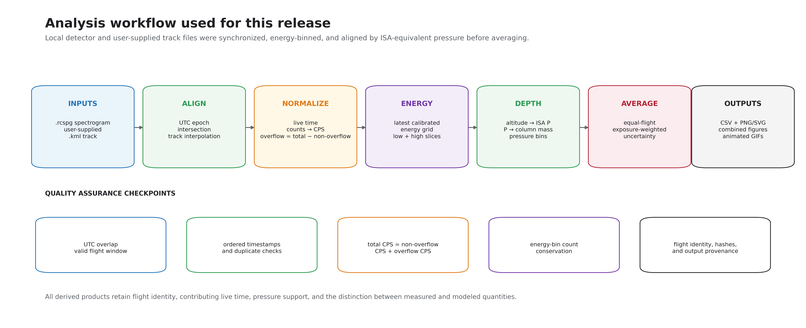

# RadiaCode flight spectroscopy

**v0.1 is a data, methods, and derived-results snapshot** from four commercial
flights recorded with one RadiaCode-103. It is intended for scientific review,
independent inspection, and method development—not as a finished atmospheric-
radiation instrument or a fully portable raw-to-figure pipeline.

RadiaCode is a trademark of RADIACODE LTD. This independent project is not
affiliated with or endorsed by RADIACODE LTD or FlightAware.

[](figures/presentation/figure_01_physics_cascade_to_detector.svg)

*Figure 01. Conceptual measurement chain; click for the scalable SVG. The
approximately 9–11 km cruise trend is schematic for the range sampled here,
below the Regener–Pfotzer maximum, and is not a global altitude-response curve.
Branches are representative and line count does not indicate particle yield.
RadiaCode records pulse height reported as γ-calibrated visible energy; it does
not identify each particle or directly measure primary cosmic-ray flux.*

**Figure 01 sources:** [PDG 2025 Cosmic Rays review](https://pdg.lbl.gov/2025/reviews/rpp2025-rev-cosmic-rays.pdf);
[Matthiä et al. (2014)](https://doi.org/10.1002/2013SW001022);
[Barrantes et al. (2018)](https://doi.org/10.22201/igeof.00167169p.2018.57.4.2105);
[Tobiska et al. (2018)](https://doi.org/10.1029/2018SW001843);
[Gordon et al. (2004)](https://doi.org/10.1109/TNS.2004.839134);
[de Mendonça et al. (2013)](https://doi.org/10.1029/2012JA018026);
[RadiaCode 100-series technical specifications](https://radiacode.com/docs/en/100-series/devices/100-series-introduction/technical-specification);
and [RadiaCode Spectrum Window documentation](https://radiacode.com/docs/en/100-series/software/windows/graphical-interface/tabs-and-windows/spectrum-window).

## What this snapshot supports

- Four included `.rcspg` spectrograms pass structural, timestamp, live-time,
  channel-count, and SHA-256 checks.
- Counts are conserved across total, non-overflow, and terminal/overflow
  channels in the committed pressure-bin tables.
- The terminal-bin rate changes strongly and nonlinearly with modeled
  atmospheric depth over these flights.
- In the 14 four-flight common-support bins, a floor-plus-exponential is the
  lowest-error of four descriptive CPS-scale fits. A zero-floor exponential is
  also close to the observed curve; this comparison is exploratory.
- For the 16-bin ATL → OMA count-level case study, the floor-plus-exponential
  has the lowest AICc, while the zero-floor exponential remains plausible
  (`ΔAICc = 3.31`). The fitted floor is a replication target, not an established
  physical component.
- A broad four-flight spectral feature has a descriptive fitted centroid of
  510.99 keV (approximate counting-statistical 68% profile interval
  508.54–513.31 keV). This same-detector raw-channel diagnostic assumes stable
  response across acquisitions; nearby held-out calibration residuals reach
  4.36 keV, and this snapshot does not establish the feature's physical origin.

> **Interpretation boundary:** pulse height, total CPS, and terminal-bin CPS are
> detector observables. Particle identity, incident energy, fluence, direction,
> and dose require a validated detector-response and geometry model.

## Featured flight

The ATL → OMA preview synchronizes accumulated spectrum, route, spectrograms,
track-reported altitude, ISA-equivalent pressure, total CPS, and overflow CPS.



[Static fallback](animations/previews/ATL-OMA_dashboard_preview_frame.png) ·
[Synchronized static panel set](animations/panels/OMA_ATL-OMA/synchronized_panel_set.png) ·
[Animation guide](animations/README.md)

*Flight-track rights notice: Contains FlightAware data © FlightAware LLC 2026.
FlightAware data and trademarks are excluded from the repository’s MIT and CC
BY 4.0 licenses. This independent project is not affiliated with or endorsed by
FlightAware.*

## Cross-flight and pressure-binned views



The shaded interval is where detector timestamps overlap the external
FlightAware track used in the local analysis. The KML files are not distributed.
The altitude series is described as **FlightAware-reported track altitude**;
this snapshot does not independently establish whether the source field is GPS/
geometric or pressure altitude.



Flights are aligned using ISA-equivalent pressure calculated from track-reported
altitude. That coordinate is a modeled atmospheric-depth proxy—not measured
cabin pressure. The terminal-channel energy label is an extrapolation beyond
the highest calibration anchor.



Figure 06 fits overflow counts with live time as Poisson exposure. Error bars
are exact 95% Poisson intervals; the green band is an approximate 95% interval
for the fitted mean curve. Parameter intervals, AICc, aggregation limitations,
and the high-depth tail are documented in the
[single-flight report](docs/featured_flight_overflow_analysis.md) and
[reproducible notebook](notebooks/atl_oma_overflow_depth_analysis.ipynb).

## Release contents and limits

| Included in v0.1 | Not claimed or not yet portable |
|---|---|
| Four original RadiaCode `.rcspg` files and hashes | Redistribution of FlightAware KML files |
| Calibration spectra, centroid uncertainties, held-out checks, and deterministic conversion | Final efficiency, dose, or full-range energy calibration |
| Compact derived pressure/depth tables and model outputs | A clean-clone raw → merged → normalized → all-figure pipeline |
| Figures, animation previews, and static fallbacks | Particle identification or species-resolved flux |
| Input validator, focused analysis scripts, notebook, and tests | A universal altitude law or causal separation of atmosphere and aircraft geometry |

The working energy calibration has nine anchors spanning channels 22.21–937.81
(approximately 59.5–2614.5 keV). Values outside that anchor-supported interval,
including the threshold-adjacent region and terminal channel, are extrapolated.
The low-energy structure therefore has no precision centroid in this release.
See the [calibration notes and validation tables](calibration/README.md).

Detector serial number and acquisition/travel dates are intentionally public in
this snapshot. Future contributors must explicitly consent to publication of
their corresponding metadata; see [CONTRIBUTING.md](CONTRIBUTING.md).

## Obtain the flight tracks

The original analysis used FlightAware KML tracks, but this repository does not
redistribute them. The steps below document provenance; they do not grant
downstream rights in a downloaded track:

1. Find the flight and matching date in FlightAware history.
2. Open the selected flight.
3. Scroll to the **Flight Track Log**.
4. Click **`+GoogleEarth`** below the track log.

The flight numbers, dates, routes, original hashes, storage guidance, and KML
format are in the [data and track-acquisition guide](data/README.md) and
[`config/flight_track_sources.csv`](config/flight_track_sources.csv). Review
[FlightAware's Terms of Use](https://www.flightaware.com/about/terms-of-use)
before using a downloaded track, and keep the raw KML outside the public
repository.

## Quick start

Install the package and run the synthetic end-to-end input check:

```powershell
python -m pip install -e .
radiacode-flight validate --manifest config/example_manifest.csv
```

Validate the four included detector inputs and hashes:

```powershell
radiacode-flight validate --manifest config/four_flights.csv
```

This second command emits one expected warning per flight because the external
track is intentionally omitted. Add a permitted local KML path in an ignored
local manifest to validate track structure and UTC overlap.

Reproduce the compact single-flight count analysis and verify Figure 01 plus
the calibration exports:

```powershell
python scripts/analyze_featured_flight_overflow.py
python scripts/build_figure_01.py --check
python calibration/recalibrate_spectra.py --check
python calibration/validate_peak_centroids.py --check
python -m unittest discover -s tests -v
```

## Analysis provenance



The committed derived products were produced from local detector/track pairs
using the workflow above. The current package exposes validation and the focused
derived-table analyses, but the complete merge, normalization, multi-figure,
and animation workflow still depends on the original local analysis environment.
That limitation is deliberate and visible in this v0.1 snapshot. See the
[command-line workflow](docs/workflow.md) and [public roadmap](docs/migration_plan.md).

## Contributing a measurement

For a scientifically useful contribution, record:

- the original `.rcspg` file and SHA-256;
- UTC flight date and route;
- detector model and serial number;
- detector placement and orientation;
- aircraft and cabin location when known;
- calibration identifier and analysis configuration;
- a locally obtained UTC track whose terms permit your intended use; and
- explicit consent for any serial, time, and travel metadata to be public.

Unknown metadata should be written as `not recorded`, not silently left blank.
See the [contribution guide](CONTRIBUTING.md) and
[reproducibility checklist](docs/reproducibility_checklist.md).

## Repository guide

| Resource | Purpose |
|---|---|
| [Claims status](docs/claims_status.md) | Supported, conditional, and out-of-scope statements |
| [Scientific scope](docs/scientific_scope.md) | Research question, controls, and validation ladder |
| [Overflow analysis](docs/overflow_pressure_analysis.md) | Four-flight descriptive pressure/depth comparison |
| [ATL → OMA case study](docs/featured_flight_overflow_analysis.md) | Count-level Poisson model and uncertainty |
| [Derived data](data/derived/README.md) | Compact tables, model outputs, and checksums |
| [Calibration](calibration/README.md) | Centroid uncertainties, held-out checks, supported range, and extrapolation |
| [Track acquisition](data/README.md) | FlightAware retrieval steps and contributor consent |
| [Presentation figures](figures/presentation/README.md) | Figure status, interpretation boundaries, and regeneration commands |
| [Expected outputs](docs/expected_outputs.md) | What is authoritative, included, or planned |
| [Release media](docs/release_assets.md) | Optional full-resolution GIF release procedure |

## Citation and license

Use [CITATION.cff](CITATION.cff) for the repository citation. Licensing is
asset-specific:

| Material | Terms |
|---|---|
| Original software and documentation text, excluding embedded third-party or FlightAware-derived material | [MIT License](LICENSE) |
| Project-owned detector/calibration data and Figures 01 and 03 | [CC BY 4.0](LICENSE-DATA.md) |
| FlightAware-derived tables, Figures 02 and 04–06, and animations | Publicly displayed for academic review; excluded from MIT and CC BY 4.0 |
| Natural Earth geographic backgrounds | Public domain; see [third-party notices](THIRD_PARTY_NOTICES.md) |

No downloaded FlightAware KML is included. The following notice applies to the
non-raw derivative products:

> Contains FlightAware data © FlightAware LLC 2026. FlightAware data and
> trademarks are excluded from the repository’s MIT and CC BY 4.0 licenses.
> This independent project is not affiliated with or endorsed by FlightAware.

Public availability does not grant downstream reuse rights in FlightAware
material. See [THIRD_PARTY_NOTICES.md](THIRD_PARTY_NOTICES.md) for the complete
rights boundary.
The `license = "MIT"` package metadata in `pyproject.toml` describes the Python
software package, not every file or datum in the repository.
